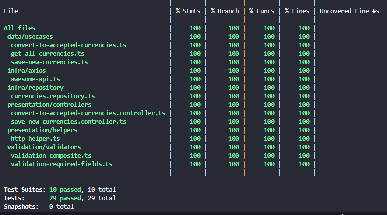
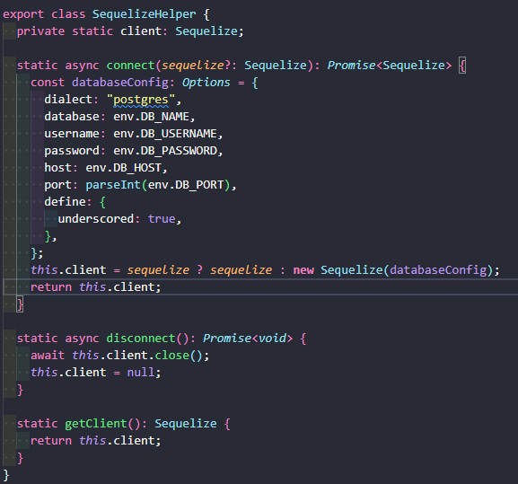

 

 <i>Currency converter<i>

 

> # Architecture

## Main libraries used:

- axios
- dotenv
- express
- pg
- pg-hstore
- sequelize
- swagger-ui-express
- winston
- umzug
- jest

## Dependencies to run the project:

- Docker
- Node

---

 

> # How to run?

### 1 - In the root of the project use the "yarn" command to install the node_modules dependencies

 

### 2 - Run the command "docker compose up" inside of the root of the project

 

### 3 - Take the file ".env.example" and remove the ".example" of his name

- After change the name of the file, insert values in the .env file

 

### 4 - Choose two coins to be used in this application and put in the .env file

- LOCAL_CURRENCY
- ALTERNATIVE_CURRENCY

Do you can only use coins that is accept in this API, here is the list of coins: https://economia.awesomeapi.com.br/xml/available/uniq

 
  
### 5 - You have to use the follow commands in the first time that you start the application.
  
- Migration - Command is "yarn migration:up"
- Seed - Command is "yarn seed:up"

 

### 6 - Now you have to decide if you gonna runner the application in the dev environment or production environment.

- DEV - Command is "yarn dev"
- PRD - Command is "yarn start"

 

> # Migrations/Seeds

This project uses sequelize as its ORM and sequelize's migration tool called Umzug. Before running any migration/seeder, you must set up DB environment variables accordingly with '.env.example'. If you need to run locally, you can use the command "yarn migration:local:up" otherwise use the command "yarn migration:up". If you need to rollback use "down" instead of "up" in this commands. support documentation for the Umzug library: https://github.com/sequelize/umzug
 
 

> # Logs

- The logs of this application is in the src/logs path.

 

> # Swagger

In the follow endpoint "/api-docs/" you can see the swagger documentation
 
<b>example:</b> http://localhost:3000/api-docs/

- GET - /convert/:currency/:value

###### 

 

- POST - /convert/:currency/:value

###### 

 

> # Unit Testing

- Here you can see the coverage of the tests in the application.

###### 

 
<b>OBSERVATION:</b> If You desire see this result in the application, use the command "yarn test:cov"

 

> # Database connection (Singleton)

#### - Here is the explication of how the connection with database was made.

The connection with database was made using a Singleton class, that gonna make the use in the application and the unit testing be more easily, because of the single instance of client database, that can be changed if we need use a new connection as we made in unit testing.

###### 

 

